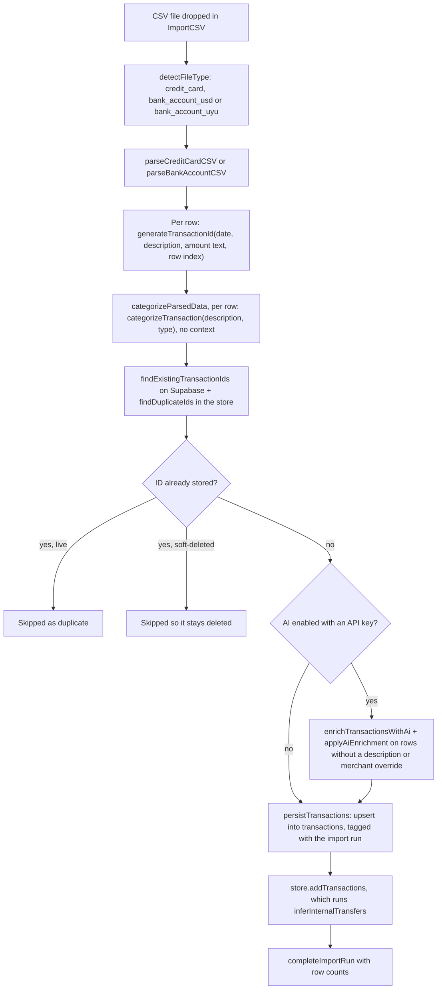
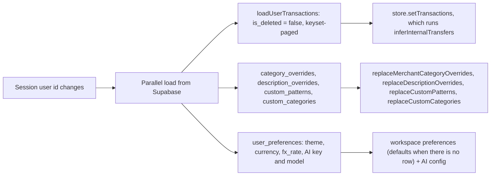
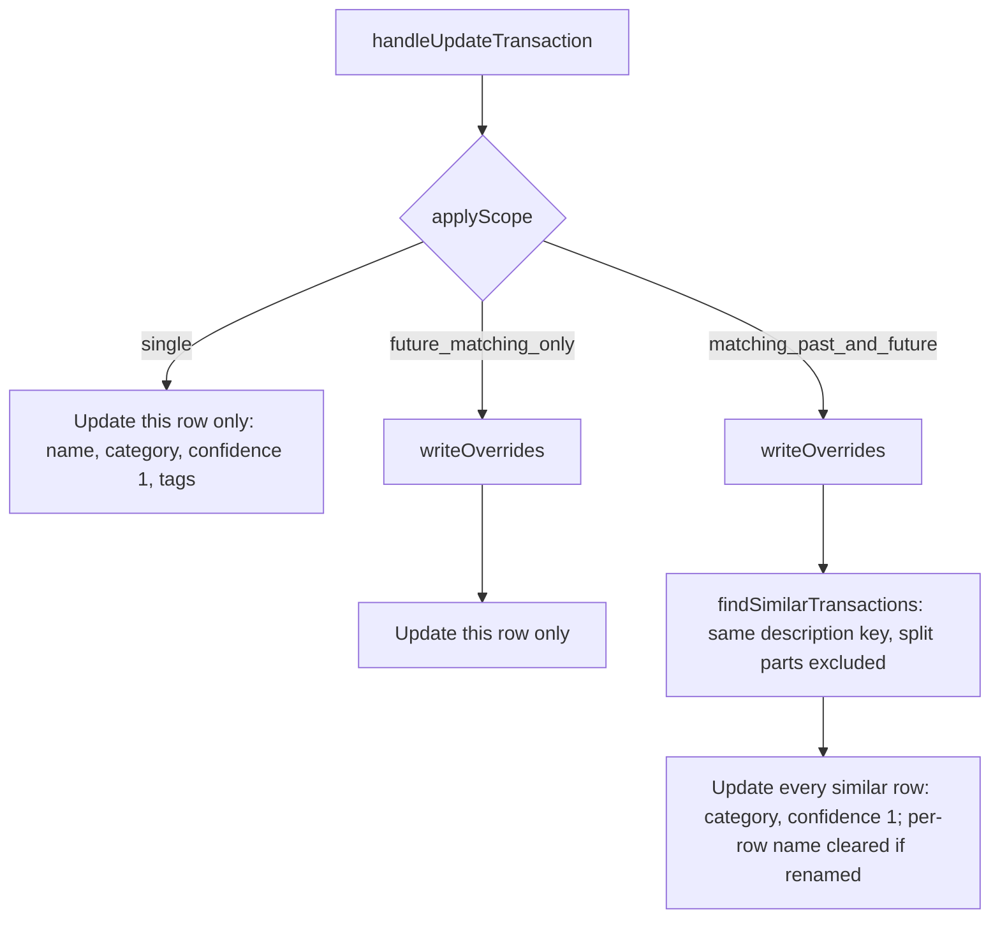

# Tatu architecture

How data moves through Tatu, the order in which categorization sources win,
where money is converted, and what is stored where. This page describes the
current code. When you change one of the flows below, update the page in the
same PR. Decisions and their reasons are in [`decisions/`](decisions/README.md);
terms are defined in [`CONTEXT.md`](CONTEXT.md).

## Import

A statement goes from file to screen in one pass in the browser.
`ImportCSV.tsx` parses, categorizes the parsed rows
(`categorizeParsedData` in `src/services/categorizer/import-categorization.ts`),
then hands them to `handleTransactionsImported` (`useTransactionHandlers.ts`).
The parsers are pure: they map columns, dates, amounts, currency and IDs and
never call the categorizer.

Details that matter:

- **Categorization at import uses only the first 8 sources** in the
  [precedence table](#categorizer-precedence). `categorizeParsedData` calls
  `categorizeTransaction` without a `CategorizationContext`, so temporal,
  similar-merchant and amount hints never run at import. Passing context there
  would change future imports' categories — a separate decision (#64 step 2).
  The golden fixture in `import-categorization.equivalence.test.ts` pins the
  sample CSVs' import categories.
- **AI enrichment replaces the rule-based result** (category, confidence and
  display name) for every new row that has no description override and no
  merchant override. That includes rows a custom pattern or merchant pattern
  already matched. If the AI call fails, the rule-based result stays and the
  error is returned as `aiError` so the UI can say so.
- **The transaction ID is the dedup key.** `generateTransactionId` hashes the
  date, description, amount text and row position, so re-importing a file
  gives the same IDs. Changing its inputs would re-ID every stored row (#57).
  The import run's SHA-256 (`sha256Hex`) is a file checksum for the audit
  record, not part of the ID.
- **Internal-transfer inference is not persisted at import.**
  `persistTransactions` writes the rows before the store adds them, and the
  store runs `inferInternalTransfers` on every write (`addTransactions`,
  `updateTransaction`, `mapTransactions`, `removeTransactions`,
  `setTransactions`). Inferred transfer categories are therefore recomputed on
  every load and not written back by the import. Only operations that upsert a
  whole row from the store (splitting) can carry one to the database.
- An import run row (`createImportRun`) is opened before writing and closed
  with `completeImportRun` or `failImportRun`. A failure to close it doesn't
  fail the import.

## Sync on sign-in

There is no local copy of user data. `src/stores/workspace-store.ts` owns
everything a signed-in user has in memory. On sign-in (and on refetch),
`useUserWorkspace` calls `hydrateWorkspace`, which loads everything from
Supabase and replaces the in-memory state in one synchronous step.

The sync depends on the user id, not the session object, so a token refresh
doesn't reload everything.

Ordering guarantees:

- **One teardown.** `teardownWorkspace` clears transactions, both override
  maps, custom patterns, custom categories, preferences (back to
  `DEFAULT_PREFERENCES`, including the Claude key) and the AI config. Sign
  out, back-to-sign-in, password update, Supabase's `SIGNED_OUT` event and
  a session that switches to another user (`setSession` in `useAuthSession`)
  all call it. Reset-all-data calls `startEmptyWorkspace`, which tears down
  and marks the same user ready with nothing.
- **Late loads are discarded.** Each hydrate takes a generation number; a
  teardown, a newer hydrate or an abandoned effect invalidates it, and a load
  that resolves late applies nothing.
- **Saves only for the loaded user.** There is no save effect. `setPreference`
  saves only when the session's user is the one whose workspace is `ready`,
  so loading preferences never writes them back and one user's values (e.g.
  their API key, #123) can't reach another user's row. Saves go out one at a
  time, coalesced to the latest values; sign-out and reset wait for them.

## Editing a category: apply-scope

`handleUpdateTransaction` takes one of three scopes from the edit dialog
("Aplicar nombre y categoría a"). The two override kinds are keyed
differently: the description override uses `buildDescriptionOverrideKey`
(dates, references and long numbers removed), the merchant override uses
`normalizeMerchantName` (lowercased, whitespace collapsed).

`writeOverrides` saves a description override (friendly name plus category)
when the name changed and clears it otherwise. It then saves a merchant
override for the category, or clears it when no category was chosen. `single`
writes no overrides, so future imports are not affected. Each write goes to
Supabase first and then to the store, keyed by the same row IDs.

Rows given a category by hand get confidence 1, so `inferInternalTransfers`
never reclassifies them afterwards.

## Categorizer precedence

`categorizeTransaction(description, type, context?)` in
`src/services/categorizer/transaction-categorizer.ts` tries these sources in
order and returns the first match. A different order changes which category
real money lands in, so keep this table and the function in sync.

| #   | Source               | Confidence                                                                                                                  | Function                                       | Notes                                                                                                                                      |
| --- | -------------------- | --------------------------------------------------------------------------------------------------------------------------- | ---------------------------------------------- | ------------------------------------------------------------------------------------------------------------------------------------------ |
| 0   | Empty description    | 0                                                                                                                           | (inline)                                       | Returns `uncategorized` before anything else when the normalized description is empty.                                                     |
| 1   | Description override | 1.0                                                                                                                         | `getDescriptionOverride`                       | Only when the override has a category.                                                                                                     |
| 2   | Merchant override    | 1.0                                                                                                                         | `getMerchantCategoryOverride`                  | Exact match on the normalized description.                                                                                                 |
| 3   | Custom pattern       | 0.95                                                                                                                        | `matchCustomPattern`                           | First matching user rule (`contains`, `starts_with`, `exact`). Can also set a display name.                                                |
| 4   | Fee keywords         | 0.95                                                                                                                        | `FEE_KEYWORDS`                                 | Whole-word match (`comision`, `cargo`, `interes`, …) → `fees`.                                                                             |
| 5   | Transfer keywords    | 0.9                                                                                                                         | `TRANSFER_KEYWORDS`                            | → `internal_transfer`. Skipped when a named external beneficiary matches `EXTERNAL_BENEFICIARY_RE`, or for a credit containing `recibida`. |
| 6   | Income keywords      | 0.9                                                                                                                         | `INCOME_KEYWORDS`                              | Credits only (`sueldo`, `salario`, `deposito`, …) → `income`.                                                                              |
| 7   | Merchant patterns    | Pattern base (0.75–0.95); × 0.95 if the match is partial; fuzzy fallback = base × similarity × 0.9, similarity at least 0.5 | `getMerchantCategory` → `matchMerchantPattern` | Built-in Uruguayan merchant list; the highest-confidence match wins.                                                                       |
| 8   | Learned patterns     | ≤ 0.75 (share of tokens matched × 0.75)                                                                                     | `matchLearnedPattern`                          | Tokens shared by at least 2 merchant overrides, more than 60% of them for one category (`buildLearnedPatterns`).                           |
| 9   | Temporal patterns    | 0.65 monthly → `utilities`; 0.4 weekly → `groceries`                                                                        | `getTemporalSuggestion`                        | Needs `context.temporalPatterns`.                                                                                                          |
| 10  | Similar merchant     | ≤ 0.6 (similarity × 0.6, similarity at least 0.5)                                                                           | `findSimilarMerchant`                          | Needs `context.categorizedMerchants`.                                                                                                      |
| 11  | Amount heuristics    | 0.15–0.25                                                                                                                   | `categorizeByAmount`                           | Debits only. Needs `context.amount` and `context.currency`.                                                                                |
| 12  | Fallback             | 0                                                                                                                           | (inline)                                       | `uncategorized`.                                                                                                                           |

Steps 9–11 only run when a `CategorizationContext` is passed. In the app that
happens only in `handleAutoCategorizeTransactions` (the "Auto-categorizar"
bulk action in Transacciones) and in the developer `CoverageAnalysis` tool.

Tests in `transaction-categorizer.test.ts` that pin the order:

- "should use description override category for noisy descriptions" (step 1)
- "should keep using merchant override when description override has no
  category" (step 1 needs a category; step 2 then wins)
- "should prioritize overrides over custom patterns" (2 before 3)
- "should use custom pattern before keywords" (3 at 0.95)
- "should prioritize fees over transfers" (4 before 5)
- "does not auto-Transfer TRANSFERENCIA RECIBIDA credits" and the
  external-beneficiary cases (step 5's exclusions)
- "should use learned patterns for new merchants" (step 8, ≤ 0.75)
- "should use temporal patterns when available" (step 9)
- "should use amount heuristics as last resort" and "should not use amount
  heuristics for credits" (step 11)

The tests don't pin every adjacent pair. For example, 1 before 2 with both
holding a category, 6 before 7, and 7 before 8 come from the code order only.

### What can change a category after the categorizer

| Step                        | Where                                                         | Effect                                                                                                                                                                                                                                                                                                                        |
| --------------------------- | ------------------------------------------------------------- | ----------------------------------------------------------------------------------------------------------------------------------------------------------------------------------------------------------------------------------------------------------------------------------------------------------------------------- |
| AI enrichment (import only) | `applyAiEnrichment`                                           | Replaces category, confidence (model value, clamped 0–1, default 0.7) and display name on new rows without a description or merchant override.                                                                                                                                                                                |
| Internal-transfer inference | `inferInternalTransfers` (store)                              | Bank rows only. Debits with transfer wording become `internal_transfer` (or `external_transfer` with a named beneficiary) at 0.9. A debit paired with a matching credit within 2 days gets 0.92, 0.95 or 0.98, depending on the match score. Skips rows at confidence 1, split rows, and rows already in a transfer category. |
| User edit / bulk categorize | `handleUpdateTransaction`, `handleBulkCategorizeTransactions` | Sets the category at confidence 1.                                                                                                                                                                                                                                                                                            |
| Rule applied to past rows   | `handleApplyPatternToPast`                                    | Sets the rule's category at 0.95 on matching rows, except split parts.                                                                                                                                                                                                                                                        |
| Auto-categorizar            | `handleAutoCategorizeTransactions`                            | Re-runs the categorizer with context on the selected rows; writes only results that are not `uncategorized`.                                                                                                                                                                                                                  |

## Dates

A transaction's `date` is a **calendar day, held as that day's UTC midnight**
(#58). The convention lives in `src/utils/date-utils.ts`:

- **Write:** `parseSantanderDate` returns `Date.UTC(y, m, d)`, so a row is the
  same instant whatever zone the importing browser is in. The transaction ID
  hashes the raw `DD/MM/YYYY` text, not the `Date`, so the convention does not
  change IDs.
- **Load:** rows stored before #58 sit at the importing browser's local
  midnight (`T03:00Z` from Uruguay). `loadUserTransactions` snaps every date to
  its calendar day with `toCalendarDay` (rounds to the nearest UTC midnight,
  right for any writer from UTC-11 to UTC+12). There is no backfill: a stored
  `T03:00Z` row is rewritten as `T00:00Z` only if something upserts the whole
  row again (splitting).
- **Read:** only UTC accessors (`getUTC*`, `toDateKey`, `toMonthKey`,
  `toISOString().slice(0, 10)`) or `Intl.DateTimeFormat`/`toLocaleDateString`
  with `timeZone: 'UTC'` (`formatDate`, `formatDateCompact`). Never
  `getDate()`/`getMonth()`/`getFullYear()` or a formatter without `timeZone` on
  a transaction date — in Uruguay that shows `T00:00Z` as the previous day.
- **Ranges:** month/period bounds are UTC (`periodRange` in `Transactions.tsx`,
  `T00:00:00.000Z`…`T23:59:59.999Z` in `useTransactionFiltering`,
  `getDateRangeForPeriod`), so a Transacciones drill-through holds exactly the
  rows Resumen summed (`toMonthKey`) for that month.
- **Day distances** (transfer pairing's ±2 days, recurring cadences) count
  whole calendar days with `calendarDaysBetween` / `utcDayNumber`.
- **Today** is the user's local calendar day: `todayAsUtcDate()` builds it from
  local `getFullYear/getMonth/getDate` and expresses it as a UTC calendar date,
  so "este mes" compares like with like. Real instants (`generatedAt`,
  `updated_at`, the PDF "Generated" line) are timestamps, not calendar days,
  and are shown in local time.

Tests run with `TZ` pinned to `America/Montevideo` (`vite.config.ts`);
`npm run test:tz` reruns the suite in `Europe/Madrid` (east of UTC) and
`America/Los_Angeles` (west of Uruguay, where a `T03:00Z` row read in local
time falls on the previous day). `TZ` can't be switched inside a test: test
workers inherit it from the main process.

## Money conversion

All conversion happens in the browser, at render or aggregation time, with
`convert(amount, from, to, rate)` from `src/services/currency/convert.ts`.
`rate` means 1 USD = `rate` UYU. Stored amounts are always native: positive
`amount` plus `currency`. Nothing converted is persisted.

| Caller                                                                                                                                                | What it converts                                               |
| ----------------------------------------------------------------------------------------------------------------------------------------------------- | -------------------------------------------------------------- |
| `chart-data.ts` (`buildCategorySpendingConverted`, `buildMonthlyTrendsConverted`, `buildCurrentMonthSummary`, `buildCurrencySplit`, `spendByAccount`) | Resumen totals, charts and account cards, in the home currency |
| `category-changes.ts` (`categoryChanges`)                                                                                                             | "Qué cambió" month comparisons and its US$ 10 noise floor      |
| `insight-data.ts` (`buildInsightInput`)                                                                                                               | Every number handed to the Insights model, rounded to cents    |
| `Dashboard.tsx`                                                                                                                                       | Merchant totals and recent rows                                |
| `Transactions.tsx`                                                                                                                                    | Filtered-set totals                                            |
| `TransactionTable.tsx`                                                                                                                                | The faint `≈` converted amount next to a native one            |

The home currency (`preferredCurrency` from `useUserWorkspace`, passed down as
`homeCurrency`) and `fxRate` (default 40.5) come from `user_preferences`.
Which rows the totals add up is decided in one place, described next.

## What counts toward totals

`src/services/spending/spending-rules.ts` owns the rule, so a number the user
clicks equals the sum of the rows it opens. Callers never re-derive it from
`isSplitParent` or `isCategoryIgnored`; a new exclusion is added there.

| Predicate                              | True for                                                                                                                                | Used by                                                                                                                                                              |
| -------------------------------------- | --------------------------------------------------------------------------------------------------------------------------------------- | -------------------------------------------------------------------------------------------------------------------------------------------------------------------- |
| `countsAsRow`                          | Every row except a split parent (an inert container its parts stand for). Ignored-category rows still count as rows.                    | Lists and row counts: `useTransactionFiltering`, Categorías counts and rule matches, the "Sin categoría" badge, `needsCategoryReview`, "Qué cambió" account coverage |
| `countsTowardTotals`                   | A row (`countsAsRow`) whose category is not ignored (`isCategoryIgnored`: transfers, the legacy `ignored` id, user-flagged categories). | Resumen's counted rows, monthly trend, month summary, the "show ignored" toggle, the export's `cuenta_en_totales` column                                             |
| `isCountedExpense` / `isCountedIncome` | `countsTowardTotals` and a `debit` / `credit`.                                                                                          | Category, currency, account and merchant spend; "Qué cambió"; every expense number in `InsightInput`                                                                 |
| `sumCountedTotals`                     | Income, expense and net of the counted rows, in the home currency.                                                                      | The Transacciones totals strip                                                                                                                                       |

**Export** (`services/export/export.ts`) writes exactly the rows it is given
and returns how many it wrote. Configuración exports every row (a full
backup, split parents and ignored rows included); Transacciones exports the
rows on screen (`filteredTransactions`, so ignored rows only with "show
ignored" on). Both CSV and PDF end with a `cuenta_en_totales` column (`1` /
`0`, from `countsTowardTotals`): summing the `1` rows gives the app's totals,
because a split parent is `0` and its parts are `1`.

## Persistence boundaries

| Data                                                                          | Store of record                                                                                 | In memory                                                                                    |
| ----------------------------------------------------------------------------- | ----------------------------------------------------------------------------------------------- | -------------------------------------------------------------------------------------------- |
| Transactions                                                                  | Supabase `transactions` (soft delete via `is_deleted` / `deleted_at`; split parts hard-deleted) | Zustand `transactionStore`, no persist middleware                                            |
| Description overrides, merchant overrides, custom patterns, custom categories | Supabase `description_overrides`, `category_overrides`, `custom_patterns`, `custom_categories`  | Module-level state in their services, replaced on sync; edits also write through to Supabase |
| Preferences, including the Claude API key                                     | Supabase `user_preferences`                                                                     | `workspaceStore` preferences; the AI config in `ai-config.ts`, derived from them             |
| Import audit                                                                  | Supabase `import_runs`                                                                          | Not loaded                                                                                   |
| Insights cache                                                                | Supabase `ai_insights`, one row per user                                                        | `Insights.tsx` state                                                                         |
| Auth session                                                                  | Supabase Auth                                                                                   | Cached in `localStorage` under `tatu:supabase:session` (`src/services/supabase/client.ts`)   |

- **Supabase is required.** There is no offline mode or local fallback;
  without a session the app shows the sign-in screen.
- **The schema is applied by hand.** `supabase/schema.sql` is the intended
  schema, and nothing in the app or CI runs it. See `supabase/README.md`.
- **Claude calls run in the browser** with the user's own key
  (`dangerouslyAllowBrowser`), both for AI enrichment (`services/ai/`) and for
  Insights (`services/insights/`). There is no backend of our own.
- **Derived state is not persisted:** inferred transfer categories, converted
  amounts, learned patterns and temporal patterns are recomputed from the
  stored data.
