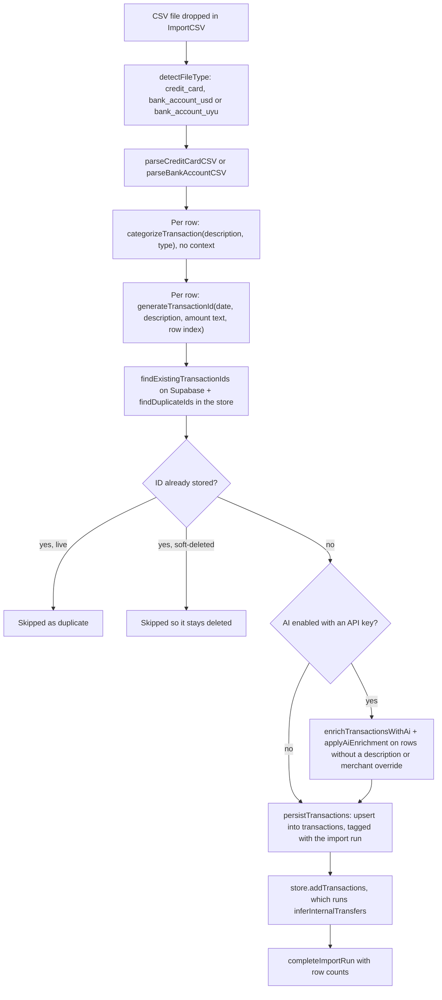
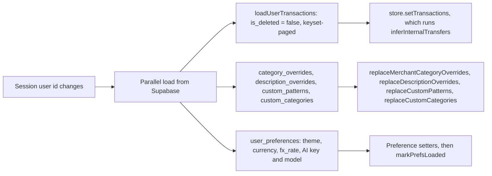
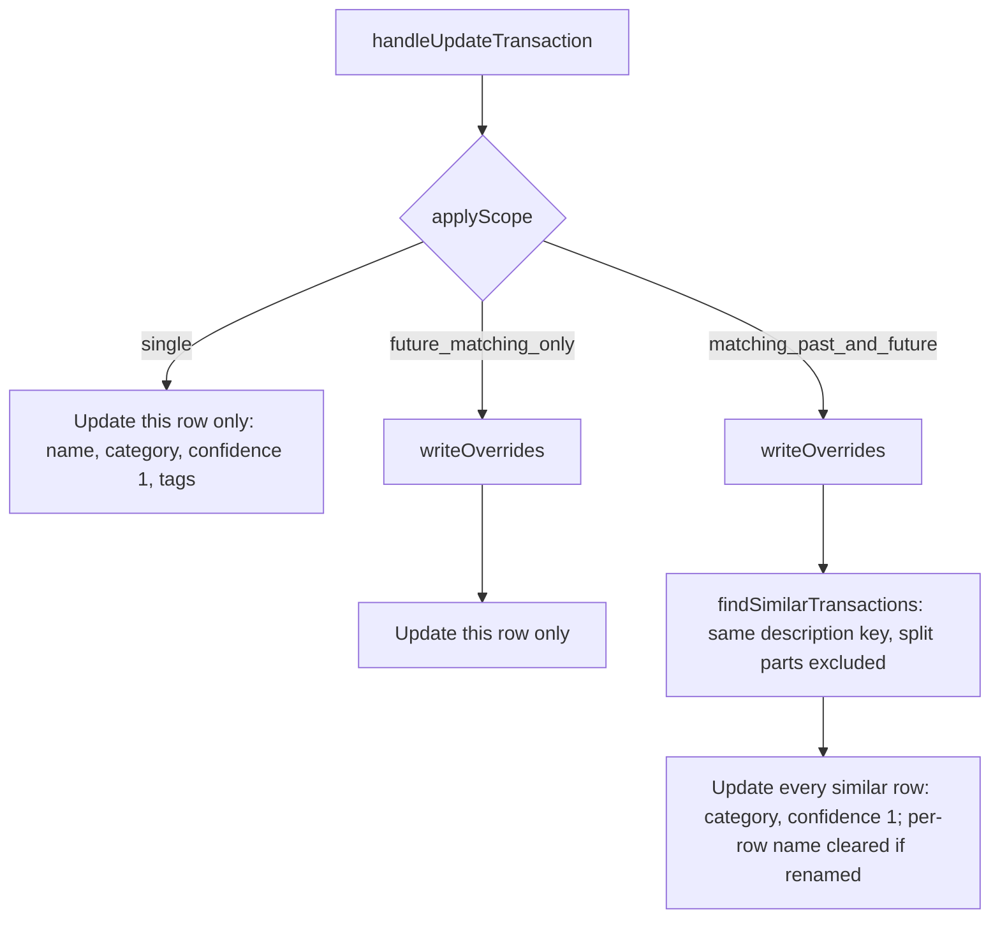

# Tatu architecture

How data moves through Tatu, the order in which categorization sources win,
where money is converted, and what is stored where. This page describes the
current code. When you change one of the flows below, update the page in the
same PR. Decisions and their reasons are in [`decisions/`](decisions/README.md).

## Import

A statement goes from file to screen in one pass in the browser.
`ImportCSV.tsx` parses, then hands the rows to `handleTransactionsImported`
(`useTransactionHandlers.ts`).

Details that matter:

- **Categorization at import uses only the first 8 sources** in the
  [precedence table](#categorizer-precedence). The parsers call
  `categorizeTransaction` without a `CategorizationContext`, so temporal,
  similar-merchant and amount hints never run at import.
- **AI enrichment replaces the rule-based result** (category, confidence and
  display name) for every new row that has no description override and no
  merchant override. That includes rows a custom pattern or merchant pattern
  already matched. If the AI call fails, the rule-based result stays and the
  error is returned as `aiError` so the UI can say so.
- **The transaction ID is the dedup key.** `generateTransactionId` hashes the
  date, description, amount text and row position, so re-importing a file
  gives the same IDs. Changing its inputs would re-ID every stored row (#57).
  The import run's SHA-256 (`sha256Hex`) is a file checksum for the audit
  record, not part of the ID.
- **Internal-transfer inference is not persisted at import.**
  `persistTransactions` writes the rows before the store adds them, and the
  store runs `inferInternalTransfers` on every write (`addTransactions`,
  `updateTransaction`, `mapTransactions`, `removeTransactions`,
  `setTransactions`). Inferred transfer categories are therefore recomputed on
  every load and not written back by the import. Only operations that upsert a
  whole row from the store (splitting) can carry one to the database.
- An import run row (`createImportRun`) is opened before writing and closed
  with `completeImportRun` or `failImportRun`. A failure to close it doesn't
  fail the import.

## Sync on sign-in

There is no local copy of user data. On sign-in, and when `syncKey` changes,
`useTransactionSync` loads everything from Supabase and replaces the in-memory
state.

The sync depends on the user id, not the session object, so a token refresh
doesn't reload everything.

## Editing a category: apply-scope

`handleUpdateTransaction` takes one of three scopes from the edit dialog
("Aplicar nombre y categoría a"). The two override kinds are keyed
differently: the description override uses `buildDescriptionOverrideKey`
(dates, references and long numbers removed), the merchant override uses
`normalizeMerchantName` (lowercased, whitespace collapsed).

`writeOverrides` saves a description override (friendly name plus category)
when the name changed and clears it otherwise. It then saves a merchant
override for the category, or clears it when no category was chosen. `single`
writes no overrides, so future imports are not affected. Each write goes to
Supabase first and then to the store, keyed by the same row IDs.

Rows given a category by hand get confidence 1, so `inferInternalTransfers`
never reclassifies them afterwards.

## Categorizer precedence

`categorizeTransaction(description, type, context?)` in
`src/services/categorizer/transaction-categorizer.ts` tries these sources in
order and returns the first match. A different order changes which category
real money lands in, so keep this table and the function in sync.

| #   | Source               | Confidence                                                                                                                  | Function                                       | Notes                                                                                                                                      |
| --- | -------------------- | --------------------------------------------------------------------------------------------------------------------------- | ---------------------------------------------- | ------------------------------------------------------------------------------------------------------------------------------------------ |
| 0   | Empty description    | 0                                                                                                                           | (inline)                                       | Returns `uncategorized` before anything else when the normalized description is empty.                                                     |
| 1   | Description override | 1.0                                                                                                                         | `getDescriptionOverride`                       | Only when the override has a category.                                                                                                     |
| 2   | Merchant override    | 1.0                                                                                                                         | `getMerchantCategoryOverride`                  | Exact match on the normalized description.                                                                                                 |
| 3   | Custom pattern       | 0.95                                                                                                                        | `matchCustomPattern`                           | First matching user rule (`contains`, `starts_with`, `exact`). Can also set a display name.                                                |
| 4   | Fee keywords         | 0.95                                                                                                                        | `FEE_KEYWORDS`                                 | Whole-word match (`comision`, `cargo`, `interes`, …) → `fees`.                                                                             |
| 5   | Transfer keywords    | 0.9                                                                                                                         | `TRANSFER_KEYWORDS`                            | → `internal_transfer`. Skipped when a named external beneficiary matches `EXTERNAL_BENEFICIARY_RE`, or for a credit containing `recibida`. |
| 6   | Income keywords      | 0.9                                                                                                                         | `INCOME_KEYWORDS`                              | Credits only (`sueldo`, `salario`, `deposito`, …) → `income`.                                                                              |
| 7   | Merchant patterns    | Pattern base (0.75–0.95); × 0.95 if the match is partial; fuzzy fallback = base × similarity × 0.9, similarity at least 0.5 | `getMerchantCategory` → `matchMerchantPattern` | Built-in Uruguayan merchant list; the highest-confidence match wins.                                                                       |
| 8   | Learned patterns     | ≤ 0.75 (share of tokens matched × 0.75)                                                                                     | `matchLearnedPattern`                          | Tokens shared by at least 2 merchant overrides, more than 60% of them for one category (`buildLearnedPatterns`).                           |
| 9   | Temporal patterns    | 0.65 monthly → `utilities`; 0.4 weekly → `groceries`                                                                        | `getTemporalSuggestion`                        | Needs `context.temporalPatterns`.                                                                                                          |
| 10  | Similar merchant     | ≤ 0.6 (similarity × 0.6, similarity at least 0.5)                                                                           | `findSimilarMerchant`                          | Needs `context.categorizedMerchants`.                                                                                                      |
| 11  | Amount heuristics    | 0.15–0.25                                                                                                                   | `categorizeByAmount`                           | Debits only. Needs `context.amount` and `context.currency`.                                                                                |
| 12  | Fallback             | 0                                                                                                                           | (inline)                                       | `uncategorized`.                                                                                                                           |

Steps 9–11 only run when a `CategorizationContext` is passed. In the app that
happens only in `handleAutoCategorizeTransactions` (the "Auto-categorizar"
bulk action in Transacciones) and in the developer `CoverageAnalysis` tool.

Tests in `transaction-categorizer.test.ts` that pin the order:

- "should use description override category for noisy descriptions" (step 1)
- "should keep using merchant override when description override has no
  category" (step 1 needs a category; step 2 then wins)
- "should prioritize overrides over custom patterns" (2 before 3)
- "should use custom pattern before keywords" (3 at 0.95)
- "should prioritize fees over transfers" (4 before 5)
- "does not auto-Transfer TRANSFERENCIA RECIBIDA credits" and the
  external-beneficiary cases (step 5's exclusions)
- "should use learned patterns for new merchants" (step 8, ≤ 0.75)
- "should use temporal patterns when available" (step 9)
- "should use amount heuristics as last resort" and "should not use amount
  heuristics for credits" (step 11)

The tests don't pin every adjacent pair. For example, 1 before 2 with both
holding a category, 6 before 7, and 7 before 8 come from the code order only.

### What can change a category after the categorizer

| Step                        | Where                                                         | Effect                                                                                                                                                                                                                                                                                                                        |
| --------------------------- | ------------------------------------------------------------- | ----------------------------------------------------------------------------------------------------------------------------------------------------------------------------------------------------------------------------------------------------------------------------------------------------------------------------- |
| AI enrichment (import only) | `applyAiEnrichment`                                           | Replaces category, confidence (model value, clamped 0–1, default 0.7) and display name on new rows without a description or merchant override.                                                                                                                                                                                |
| Internal-transfer inference | `inferInternalTransfers` (store)                              | Bank rows only. Debits with transfer wording become `internal_transfer` (or `external_transfer` with a named beneficiary) at 0.9. A debit paired with a matching credit within 2 days gets 0.92, 0.95 or 0.98, depending on the match score. Skips rows at confidence 1, split rows, and rows already in a transfer category. |
| User edit / bulk categorize | `handleUpdateTransaction`, `handleBulkCategorizeTransactions` | Sets the category at confidence 1.                                                                                                                                                                                                                                                                                            |
| Rule applied to past rows   | `handleApplyPatternToPast`                                    | Sets the rule's category at 0.95 on matching rows, except split parts.                                                                                                                                                                                                                                                        |
| Auto-categorizar            | `handleAutoCategorizeTransactions`                            | Re-runs the categorizer with context on the selected rows; writes only results that are not `uncategorized`.                                                                                                                                                                                                                  |

## Money conversion

All conversion happens in the browser, at render or aggregation time, with
`convert(amount, from, to, rate)` from `src/services/currency/convert.ts`.
`rate` means 1 USD = `rate` UYU. Stored amounts are always native: positive
`amount` plus `currency`. Nothing converted is persisted.

| Caller                                                                                                                                                | What it converts                                               |
| ----------------------------------------------------------------------------------------------------------------------------------------------------- | -------------------------------------------------------------- |
| `chart-data.ts` (`buildCategorySpendingConverted`, `buildMonthlyTrendsConverted`, `buildCurrentMonthSummary`, `buildCurrencySplit`, `spendByAccount`) | Resumen totals, charts and account cards, in the home currency |
| `category-changes.ts` (`categoryChanges`)                                                                                                             | "Qué cambió" month comparisons and its US$ 10 noise floor      |
| `insight-data.ts` (`buildInsightInput`)                                                                                                               | Every number handed to the Insights model, rounded to cents    |
| `Dashboard.tsx`                                                                                                                                       | Merchant totals and recent rows                                |
| `Transactions.tsx`                                                                                                                                    | Filtered-set totals                                            |
| `TransactionTable.tsx`                                                                                                                                | The faint `≈` converted amount next to a native one            |

The home currency (`preferredCurrency` in `useUserPreferences`, passed down as
`homeCurrency`) and `fxRate` (default 40.5) come from `user_preferences`.
Totals leave out ignored categories (`isCategoryIgnored`) and split parents;
`isExcludedFromTotals` combines the two checks.

## Persistence boundaries

| Data                                                                          | Store of record                                                                                 | In memory                                                                                    |
| ----------------------------------------------------------------------------- | ----------------------------------------------------------------------------------------------- | -------------------------------------------------------------------------------------------- |
| Transactions                                                                  | Supabase `transactions` (soft delete via `is_deleted` / `deleted_at`; split parts hard-deleted) | Zustand `transactionStore`, no persist middleware                                            |
| Description overrides, merchant overrides, custom patterns, custom categories | Supabase `description_overrides`, `category_overrides`, `custom_patterns`, `custom_categories`  | Module-level state in their services, replaced on sync; edits also write through to Supabase |
| Preferences, including the Claude API key                                     | Supabase `user_preferences`                                                                     | `useUserPreferences` state; the AI config in `ai-config.ts`                                  |
| Import audit                                                                  | Supabase `import_runs`                                                                          | Not loaded                                                                                   |
| Insights cache                                                                | Supabase `ai_insights`, one row per user                                                        | `Insights.tsx` state                                                                         |
| Auth session                                                                  | Supabase Auth                                                                                   | Cached in `localStorage` under `tatu:supabase:session` (`src/services/supabase/client.ts`)   |

- **Supabase is required.** There is no offline mode or local fallback;
  without a session the app shows the sign-in screen.
- **The schema is applied by hand.** `supabase/schema.sql` is the intended
  schema, and nothing in the app or CI runs it. See `supabase/README.md`.
- **Claude calls run in the browser** with the user's own key
  (`dangerouslyAllowBrowser`), both for AI enrichment (`services/ai/`) and for
  Insights (`services/insights/`). There is no backend of our own.
- **Derived state is not persisted:** inferred transfer categories, converted
  amounts, learned patterns and temporal patterns are recomputed from the
  stored data.
